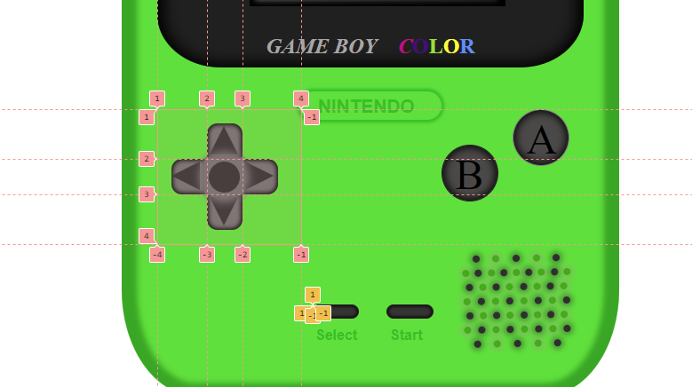
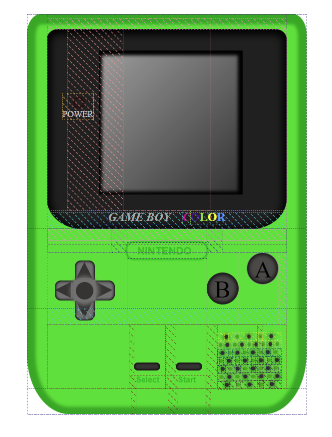

# Geekshubs Academy FSD 04-2023

## Primer proyecto-Videoconsola con CSS

## Tabla de contenidos

- [Inspiración:sparkles:](#inspiración)
- [Proceso:hammer:](#proceso)
- [Funcionamiento:bulb:](#desarrollo)
- [Licencia y Copyright📃](#licencia-y-copyright)

### Inspiración

La inspiración ha sido basada en la videoconsola Nintendo Game Boy Color del año 1998, pero aplicando un color y gradiente personalizado.

> 

### Proceso

Se ha utilizado herramientas com HTML, CSS y conocimientos básicos del JavaScript para el proceso de creación de esta videoconsola.

- Primero se ha dado el tamaño al cuerpo de la consola, posteriormente dividido en varias secciónes para que el trabajo sea más fluido a la hora del diseño con CSS.
- Se ha utilizado tanto **display-flex**, como **display-grid**, aunque principalmente esta diseñada con valores del **display-flex**. **Display-grid** se ha utilizado para el diseño de la cruceta.
- Los elementos que se puede observar están creados con HTML y CSS, no se han utilizado imágenes insertadas del logo del Nintendo, se ha hecho de este modo para poder practicar mejor el funcionamiento del display-flex, con sus margenes y similares.
- Se han utilizado conocimientos básicos del JavaScript para poder hacer una mínima interacción con el usuario.

**Ejemplos: *Display - grid y Display - flex***
>  
> 

### Funcionamiento

Con esta videoconsola Nintendo Game Boy Color se ha conseguído una interracción mínima con el usuario, se puede ejecutarse desde nuestro navegador web y el usuario puede interactuar con la consola de siguiente modo:

- Los botones que aparecen en la consola **cambián de aspecto al clicar** pulsando con el curso sobre ellos, asi conseguimos un efecto **real**.
- Los botones **start** y **select** a parte de la función general, realizan una animación al pulsar sobre ellos.
- Con el boton **start** se ejecute animación del encendido original de la consola, además se ilumína **led** del símbolo **POWER**.
- Con el botón **select** se ejecute una animación diferente del Super Mario

***Ejemplo con el boton start***:

>  

***Ejemplo con el boton select***:

>  

### Licencia y Copyright

*Los GIFs utilizados en la réplica de esta videoconsola, son propiedad de Nintendo Co., Ltd.*
