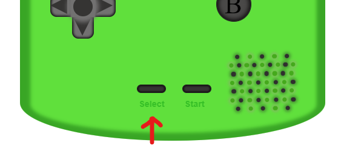

<h1 align="center">Geekshubs Academy FSD 04-2023</h1>

<h1 align="center">First project - Game Console with CSS</h1>

## Table of Contents

- [Inspiration:sparkles:](#inspiration)
- [Process:hammer:](#proceso)
- [Functionality:bulb:](#functionality)
- [Used technology🪀](#sed-technology)
- [License y Copyright📃](#license-y-copyright)

### Inspiration

The inspiration has been based on the Nintendo Game Boy Color video console from 1998, but applying a custom color and gradient.

> 

### Process

Tools such as HTML, CSS and basic knowledge of JavaScript have been used for the process of creating this game console.

- First the body of the console has been given the size, later it was divided into several sections for fluid work while designing with CSS.
- Both **display-flex** and **display-grid** have been used, although it is mostly designed with **display-flex** values. **Display-grid** has been used for the layout of the crosshead.
- The elements that can be observed are created with HTML and CSS, inserted images of the Nintendo logo have not been used, it has been done this way to practice the operation of display-flex, with its margins and the rest of its properties.
- Basic knowledge of JavaScript has been used to perform minimal user interaction.

***Examples: Display - grid y Display - flex***
>  
> 

### Functionality

With this Nintendo Game Boy Color game console minimal user interaction has been achieved, it can be run from our web browser and the user can interact with the console as follows:

- The buttons that appear on the console **change their appearance when clicked** by clicking with the cursor on them, so we get a **real** effect.
- The **start** and **select** buttons, apart from their general function, perform an animation when clicked on them.
- With the **start** button, the animation of the original power on of the console is executed, in addition the **led** of the **POWER** symbol lights up.
- With the **select** button a different animation of Super Mario is displayed.

***Examples with the start button***:

>  

***Examples with the select button***:

>  

### Used technology

### License y Copyright

*The GIFs used in the replica of this game console are the property of Nintendo Co., Ltd.*
